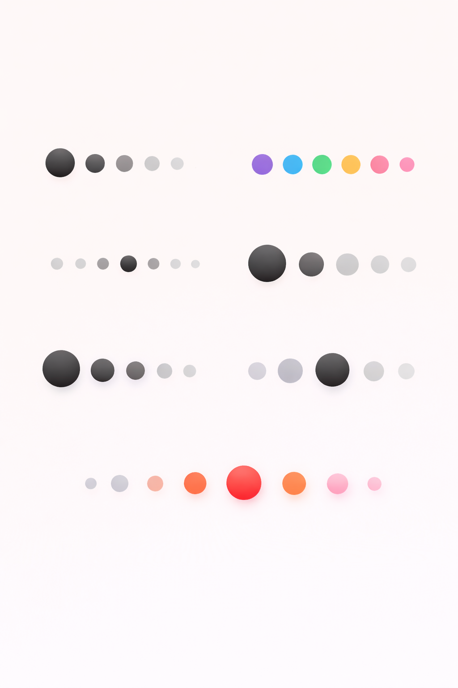

## PrimaryDotIndicator
[](https://kotlinlang.org/)
[](LICENSE)
[](#)

A lightweight and customizable Dot Indicator library for Android built with Kotlin.
Perfect for onboarding screens, image sliders, ViewPager2 carousels, and page indicators.

---

### Features

- Simple and lightweight dot indicator
- Fully customizable via XML attributes
- Supports active/inactive dot colors
- Adjustable dot radius and spacing
- Automatically syncs with ViewPager2
- Clickable dots (tap to jump pages)
- Center aligned dots for modern UI
- Easy integration with any adapter

---

### Preview

Here are some example dialogs created using this library:



---

## Installation (JitPack)

### 1️⃣ Add JitPack to your **root `settings.gradle` or `build.gradle`**

```gradle
dependencyResolutionManagement {
    repositories {
        google()
        mavenCentral()
        maven { url 'https://jitpack.io' }
    }
}
```
### Add Dependency
```
	dependencies {
	        implementation 'com.github.Excelsior-Technologies-Community:Android_CustomDotIndicator:1.0.0'
	}
```

---

### Usage

Basic Dot Indicator (XML)
```xml
<com.ext.primarydotindicator.PrimaryDotIndicator
    android:id="@+id/dotIndicator"
    android:layout_width="wrap_content"
    android:layout_height="wrap_content"
    app:dotCount="5"
    app:selectedIndex="0"
    app:activeColor="#FF0000"
    app:inactiveColor="#CCCCCC"
    app:dotRadius="8dp"
    app:dotSpacing="20dp" />
```

Update Dots Dynamically (Kotlin)
```kotlin
val indicator = findViewById<PrimaryDotIndicator>(R.id.dotIndicator)

indicator.setDotCount(6)
indicator.setSelectedIndex(2)
```

Attach Indicator to ViewPager2
```kotlin
indicator.attachToViewPager(viewPager)
```

Clickable Dots Support

Tap dot → ViewPager jumps to that page
```kotlin
indicator.attachToViewPager(viewPager)
```

---

### Customization Attributes

| Attribute       | Type       | Description                  |
|----------------|------------|------------------------------|
| `dotCount`      | Integer    | Total number of dots         |
| `selectedIndex` | Integer    | Currently active dot         |
| `activeColor`   | Color      | Color of active dot          |
| `inactiveColor` | Color      | Color of inactive dots       |
| `dotRadius`     | Dimension  | Radius of each dot           |
| `dotSpacing`    | Dimension  | Space between dots           |

---

### License

```
MIT License

Copyright (c) 2025 Excelsior Technologies 

Permission is hereby granted, free of charge, to any person obtaining a copy
of this software and associated documentation files (the "Software"), to deal
in the Software without restriction, including without limitation the rights
to use, copy, modify, merge, publish, distribute, sublicense, and/or sell
copies of the Software, and to permit persons to whom the Software is
furnished to do so, subject to the following conditions:

The above copyright notice and this permission notice shall be included in all
copies or substantial portions of the Software.

THE SOFTWARE IS PROVIDED "AS IS", WITHOUT WARRANTY OF ANY KIND, EXPRESS OR
IMPLIED, INCLUDING BUT NOT LIMITED TO THE WARRANTIES OF MERCHANTABILITY,
FITNESS FOR A PARTICULAR PURPOSE AND NONINFRINGEMENT. IN NO EVENT SHALL THE
AUTHORS OR COPYRIGHT HOLDERS BE LIABLE FOR ANY CLAIM, DAMAGES OR OTHER
LIABILITY, WHETHER IN AN ACTION OF CONTRACT, TORT OR OTHERWISE, ARISING FROM,
OUT OF OR IN CONNECTION WITH THE SOFTWARE OR THE USE OR OTHER DEALINGS IN THE
SOFTWARE.
```


